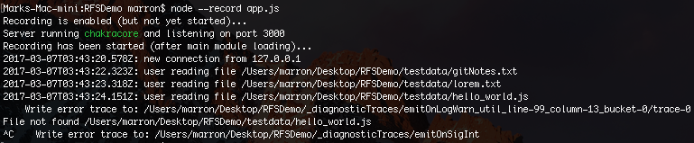
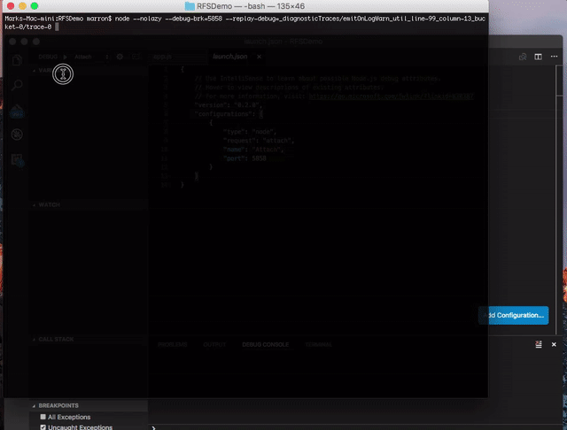

# Diagnostic Tracing and Time Travel Debugging with Node-ChakraCore
In post-mortem debugging scenarios, developers frequently find themselves 
hunting for failure clues (e.g. error text) in the log files and then searching
for those clues in their code. Once the log statement is found in the source code, 
the developer is often left to re-construct the context of the error.

The cutting edge diagnostic capabilities in Node-ChakraCore allows developers to 
look at the faulting code within the full fidelity of the debugger with all the 
runtime context preserved, enabling them to deeply inspect the code as it was during 
the original execution. Node-Chakracore has been extended with a suite of such features 
to support tracing and reproducing program executions and a range of updates to improve 
the time-travel debugging experience. 

This project is being developed in the open and we are always happy to get feedback, bug reports, 
functionality requests, and pull-requests from the community.

## Diagnostic Tracing
Reproducing issues that depend on a specific interleaving of callbacks, specifics of 
a server configuration or users system, or transient network/file-system behavior can be 
challenging. To help simplify the process we have updated Node-ChakraCore with a suite 
of **diagnostic tracing** features. These features allow you to record an application 
execution using the `--record` flag and, then when any of the conditions listed below 
occur, a diagnostic trace is written out to disk (with the location printed to 
`stderr`). 

Default trace emit events:
- Unhandled exceptions *always* emit a trace.
- Exit with a non-zero exit code *always* emits a trace.
- Failed `asserts` *probabilistically* emit a trace with a backoff to prevent overloading.
- Calls to `console.error` and `console.warn` *probabilistically* emit a trace with a backoff to prevent overloading.
- A `SIGINT` signal will *always* emit a trace.

When we run with our remote-file server [demo](https://github.com/mrkmarron/RFSDemoJS) with the record flag and 
hit a bug in the file I/O code (followed by crtl-c on the command line) we get the output shown below.



Once written to disk these trace directories can be used locally or copied to another machine 
for later analysis and debugging. To reproduce the execution trace in `dir` with a debugger
simply invoke node using `--no-lazy --debug-brk=port --replay-debug=dir` and attach the debugger. 

The animation below shows us launching the trace execution on the command line and attaching the debugger. 
When the trace hits the point where it emitted the `emitOnLogWarn` trace it will break into the debugger 
allowing us to inspect local variables, the call stack and, set a breakpoint where the callback that received 
the I/O error was registered. Then we reverse-execute back-in-time to this callback registration and can 
inspect local variables as well as the full call stack as they existed then. 



If desired we can single step-back through other statements as well or execute forward again, seeing the 
exact set of statements and variable values that existed during the original execution, until we have 
all the information we need to understand the problem.

## Time-Travel Debugging 

TTD functionality is available in Node-ChakraCore and is supported by 
[VSCode](https://code.visualstudio.com/). As shown previously you can use 
node to re-execute from the trace with debugging support, using the `--replay-debug` 
flag, and then attaching the (VSCode) debugger. However, it is also possible to 
initiate time-travel debugging directly from VSCode. This is done by:
- Creating an empty `dummy.js` file in the trace directory.
- Ensure Node-ChakraCore is on your path.
- Adding the following configuration into your `.vscode\launch.json` configuration file.
```
{
    "name": "TTDebug",
    "type": "node",
    "request": "launch",
    "program": "${workspaceRoot}/dummy.js",
    "stopOnEntry": true,
    "cwd": "${workspaceRoot}",
    "runtimeArgs": [
        "--nolazy", 
        "--replay-debug=./"
    ]
}
```

## How to get started
To get started with diagnostic tracing and TTD you will need the following:

- Install [Node-ChakraCore](https://github.com/nodejs/node-chakracore/releases)
    - (Recommended) install [NVS](https://github.com/jasongin/nvs/blob/master/doc/SETUP.md) which is a cross-platform tool for switching between different versions and forks of Node.js and will allow you to easily switch between Node-ChakraCore and other Node.js versions. Once NVS is installed simply enter the following commands in the console:
        
        ```
        nvs remote chakracore https://github.com/nodejs/node-chakracore/releases 
        nvs add chakracore/latest
        nvs use chakracore
        ```
    - (Manual) Download the build for your platform/architecture and manually add the location of the binaries to your path.
- Install [VSCode](https://code.visualstudio.com/) using the latest installer.

## Sample Program
The code for the Remote File System sample demo'ed at NodeInteractive is available 
[here](https://github.com/mrkmarron/RFSDemoJS). 

You can clone the repo to a location of your choice and `npm install` the dependencies. Once 
you launch the application it will serve up the contents of the folder `testdata` on port 3000. The 
application is designed to intermittently rename the files `hello_world.js <-> helloWorld.js` 
in the background. So, as shown in the screenshot above, a warn trace can be triggered by interacting 
with the application and clicking on this file at various times. You can always trigger a sigint 
trace via crtl-c at the command line.

Once this trace is written it can be replay debugged in VSCode using `--replay-debug=dir` as described 
above and shown in the gif. 

## Feedback
Please let us know on our [issues page](https://github.com/nodejs/node-chakracore/issues) if 
you have any question or comment. 

